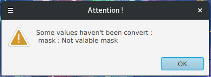

# NetConfig

## What is NetConfig?

A little tool which aim you to know more about your IPv4 configuration

## Get started

### launch the app

In order to start the application, we need to have [java 11](https://www.oracle.com/fr/java/technologies/javase-jdk11-downloads.html), or higher, installed on your computer. You can start the app by running the next command in your terminal:

``` shell
java -jar NetConfig-*.jar
```

### how it work?

The next picture represents the main frame of the application.

<p align="center">
  
</p>

**Caption:**

+ Mode section:
  + `DEC`: means decimal, your input data will be interpreted as decimal (ex:`192.168.1.14`)
  + `BIN`: means binary, your input data will be interpreted as decimal (ex:`11000000.10101000.00000001.00001110`)
  + `HEX`: means hexadecimal, your input data will be interpreted as decimal (ex:`c0:a8:01:0e`)
+ Input section:
  + `Address`: text field to enter an ipv4 address according to the selected mode
  + `Mask`: text field to enter an ipv4 mask according to the selected mode
+ Output section:
  + `Network`: Network address
  + `Broadcast`: Boradcast address
  + `Higher`: Higher available address
  + `Lower`: Lower available address
  + `Number of available address`: isn't that clear enough? :smile:
+ `Enter` button: Start the computation
+ `Exit` button: Exit the application

After the computation, you can change the mode to see the result in an other base (`HEX`, `BIN`, `BIN`).

If the ask for computation and there is a mistake in your data, nothing will happened.

If you change the base and there is a mistake in your data, a warning message will appear to tell you that the conversion hasn't been made.



